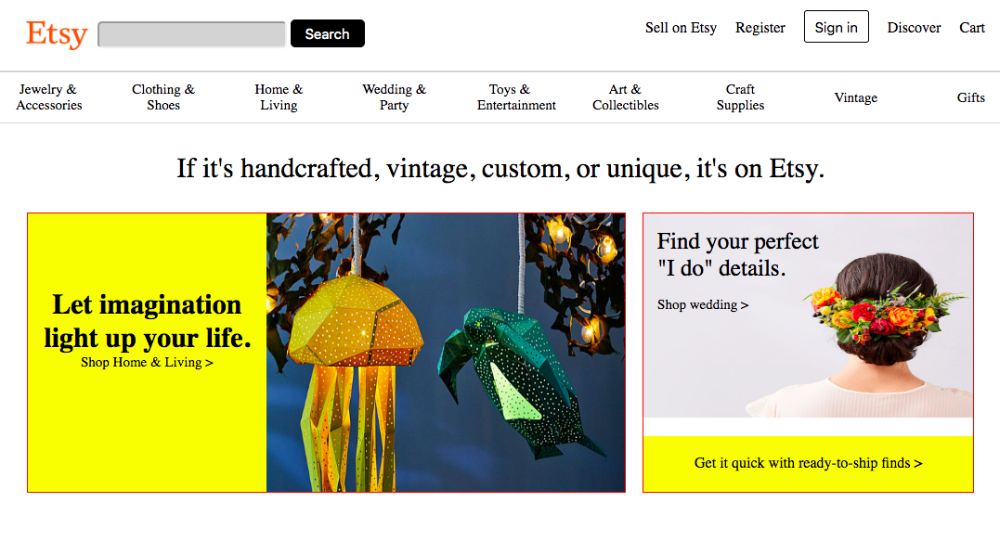
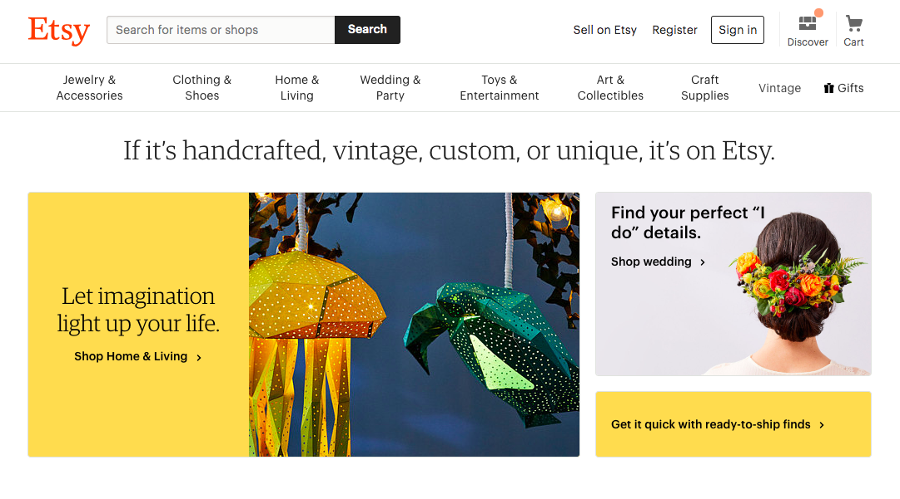

# _angular-friday_

#### _Clone of Etsy_

#### By _**Nayomi Morita**_

## Description

_A webpage that mimics the functionality of Etsy with Angular components._

## Specs
* _CSS styling that mimics the homepage of Etsy_
* _Media Queries that allow for different screen sizes_
* _As a user I want to see the current "popular now" results, and be able to click them using the list component_

## Components
* _List component: will list "popular now" descriptors from firebase_

## Completed Features
* _Page header with working media queries for multiple sizes_
* _Page quote with working media queries for multiple sizes_
* _Main shop grid with working media queries for multiple sizes_
* _Populars grid with working media queries for multiple sizes_

## Goals for today
* _Style populars and have working media queries: completed_
* _Successfully setup firebase database: completed_
* _App communication with firebase: completed_
* _Display of firebase data: in progress_
* _Routing from list component: in progress_

## Research
* _Reading into firebase/looking at other projects_
* _I'm still very confused over syntax and how everything is moving_

## My Clone:

## Original Site:

## Setup
* _Clone this repository_
https://github.com/nayomi-morita/angular-friday.git
* _Use chosen code editor to make changes (I used atom)._
* _Install node/homebrew on device_
* _Run "npm i" in terminal in angular-friday project_
* _Run "ng serve --open" in terminal to start/open webpage_

## Tech used
* _HTML_
* _CSS_
* _Angular_
* _Webpack_
* _JavaScript_

### license

Copyright (c) 2019 **Nayomi Morita**

This software is licensed under the GPL license.
